# Title: Take-Home Assessment

Author name: Chulhoon Jang (chulhoonjang@gmail.com)

Date of submission: May 1st

## Summary

This report presents a systematic approach to image scene classification using the Intel Image Classification Dataset. Starting from exploratory data analysis, an augmentation pipeline and synthetic data generation via Stable Diffusion were employed to improve data diversity. A lightweight custom CNN (1.7M parameters) was built as a baseline, achieving a Macro F1 of 92.48% from scratch. Transfer learning with ConvNeXt-Tiny was then explored under three unfreezing strategies, reaching a best Macro F1 of 95.74%. Grad-CAM visualizations on out-of-distribution samples (STL-10) revealed that the model has partially learned scene-level representations, though generalization remains inconsistent. Finally, a data refinement pipeline was constructed to identify and correct mislabeled samples, which improved performance to 93.53% and 96.39% for the CNN baseline and ConvNeXt-Tiny respectively after retraining. The results highlight that dataset quality is a critical bottleneck, and that a compact, well-optimized CNN can be a competitive alternative to larger models in resource-constrained settings.

---

## Part 1 - Data Engineering & Augmentation

---

### 1.1 — Exploratory Data Analysis (EDA)

EDA is an important step before diving into training — not only to understand the purpose of the dataset, characteristics, image quality, image size, and class distribution, but also to identify data imbalance, missing or corrupted samples, and pixel statistics, as well as to get familiar with the folder structure and APIs to read annotations and sensor data correctly.

* **Class distribution and any imbalance present**

  The Intel Image Classification Dataset is relatively well-balanced across 6 classes and split well (train: ~14k, test: ~3k, pred: ~7.3k, total: ~24k).

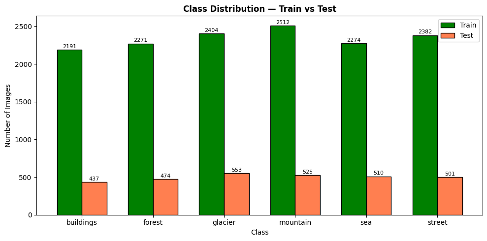

* **Sample visualization**

  Sample visualization is essential to check image quality and how each class looks. Through this process, we can confirm diversity across labels and compare train and test sets. 

  During sample visualization, several mislabeled images were identified. For example, the sample in (see row 3, col 3) labeled as glacier appeared to contain a musical band, suggesting potential label noise in the dataset. Additionally, ambiguous cases were observed between *buildings* and *street*, as well as between *glacier* and *mountain*, as these visually similar classes share overlapping features that may further contribute to label noise.

* **Image size distribution**

  Analyzing the distribution of image sizes helps determine the model input resolution. In this dataset, the average image size is 150×150 pixels, however, some samples have an aspect ratio of up to 2.0. These samples can still be fed into the model via resizing, but since their aspect ratios differ significantly from the majority of samples, it is worth investigating whether this introduces any performance degradation.

| Split         | Stat | Width (W) | Height (H) | Ratio (W/H) |
| ------------- | ---- | --------- | ---------- | ----------- |
| **seg_train** | mean | 150.0     | 149.9      | 1.001       |
|               | std  | 0.0       | 1.9        | 0.019       |
|               | min  | 150       | 76         | 1.000       |
|               | max  | 150       | 150        | 1.974       |
| **seg_test**  | mean | 150.0     | 149.9      | 1.001       |
|               | std  | 0.0       | 2.5        | 0.032       |
|               | min  | 150       | 72         | 1.000       |
|               | max  | 150       | 150        | 2.083       |
| **seg_pred**  | mean | 150.0     | 150.0      | 1.000       |
|               | std  | 4.1       | 2.8        | 0.010       |
|               | min  | 150       | 100        | 1.000       |
|               | max  | 500       | 374        | 1.500       |

* **Mean and standard deviation per channel**

  The per-channel mean and standard deviation of RGB images are used to normalize input images, which helps stabilize model performance. These values vary across datasets, and for optimal performance, they should be computed directly from the dataset rather than using generic values. Since loading all images into memory at once is inefficient, only the per-channel sum, sum of squares, and pixel count are accumulated to derive the final mean and standard deviation. When dealing with a large number of images, multi-threading can be employed to speed up the computation.

| Split         | Stat     | R          | G          | B          |
| ------------- | -------- | ---------- | ---------- | ---------- |
| **seg_train** | **Mean** | **0.4302** | **0.4575** | **0.4538** |
|               | **Std**  | **0.2694** | **0.2679** | **0.2983** |
| **seg_test**  | Mean     | 0.4332     | 0.4585     | 0.4551     |
|               | Std      | 0.2703     | 0.2690     | 0.2975     |
| **seg_pred**  | Mean     | 0.4340     | 0.4604     | 0.4548     |
|               | Std      | 0.2702     | 0.2680     | 0.2979     |

---

### 1.2 - Augmentation Pipeline

Data augmentation enhances model robustness and improves generalization performance. In this work, the Albumentations library was used due to its speed and wide variety of implemented techniques. The augmentation pipeline was composed of representative methods including color jitter, flip, crop, affine transformation, and coarse dropout, and was applied exclusively to the training set, while validation and test sets were only subject to resizing and normalization. It is recommended to evaluate model performance after the first round of training, identify samples where accuracy is low, and then update the pipeline in the next round with augmentation strategies that specifically target those failure cases.

* Color / Photometric transform: RandomBrightnessContrast, HueSaturationValue

* Geometric transform: HorizontalFlip, RandomResizedCrop, Affine

* Regularization-style transform: CoasreDropout

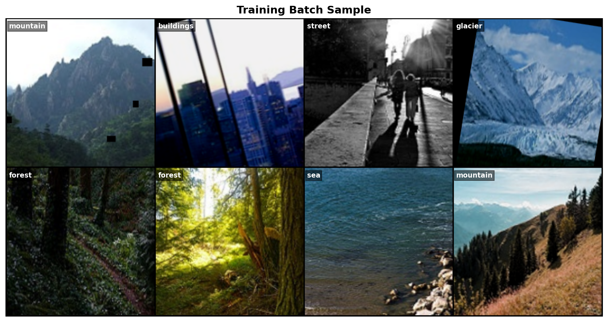

---

### 1.3 - Synthetic Data

Synthetic data can help address class imbalance and improve model generalization. Copy-paste and mosaic augmentations are easy to implement and integrate into the training pipeline, and tend to be particularly effective for segmentation and object detection tasks, though their benefit for classification is more limited. GAN and Stable Diffusion-based generation require significant compute but can produce entirely new images, offering the greatest diversity; however, the quality of generated images should be validated to ensure distribution alignment with the original dataset. Style transfer offers a middle ground by preserving the content of existing images while altering their texture and color, and is commonly used in domain adaptation scenarios, though it was not explored in this work.

In this work, Stable Diffusion was selected *after the first round of training*, as a number of ambiguous images were found to degrade classification accuracy, and the availability of pre-trained models via Hugging Face made environment setup straightforward. A total of 440 images were generated across the glacier and forest classes, with 220 images per class. Each batch of 220 included 20 reserve images intended to replace any poorly generated samples. Generation was performed on a T4 GPU, taking approximately 30–40 minutes per class. The main limitations of this approach are that prompts must be carefully designed to reflect the target domain, and while randomness contributes to diversity, it can also produce off-target images, necessitating manual quality inspection of each generated sample.

| Method                 | Pros                                                         | Cons                                                         |
| ---------------------- | ------------------------------------------------------------ | ------------------------------------------------------------ |
| Copy-paste / Mosaic    | Easy to implement, fast, simple pipeline integration         | Limited benefit for classification, no new content created   |
| GAN / Stable Diffusion | Highest diversity, generates entirely new images             | High compute cost, prompt design required, manual quality inspection needed, risk of distribution mismatch |
| Style Transfer         | Moderate compute, preserves content structure, useful for domain adaptation | Less diversity than generative models, limited new content   |

**Samples of synthetic data for glacier**: There is a poorly generated image at (row 1, col 2)

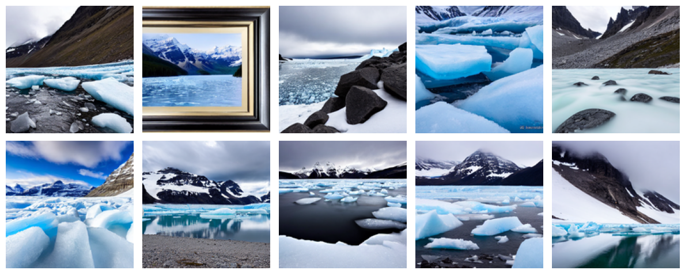

**Samples of synthetic data for forest**: There is a poorly generated image at (row 2, col 1)

---

## Part 2 — Transfer Learning & Fine-Tuning

Note: **Macro F1** (averaged F1 across classes) is used as the key KPI for model comparison. Evaluation is performed on the held-out test set. Only the original training dataset with augmentation pipelines is used in this section to evaluate model performance without the synthetic dataset.

---

### 2.1 - Baseline Model

**Description**

A lightweight custom CNN was built as a baseline. The architecture consists of a convolutional block (Conv2d → BatchNorm2d → ReLU → MaxPool2d) stacked 5 times as a feature extractor, progressively doubling the number of channels from 32 to 512 while halving the spatial resolution at each stage. The classifier head applies adaptive average pooling to collapse the spatial dimensions, followed by two fully connected layers with dropout (0.3 and 0.1) for regularization. The total number of parameters is approximately 1.7M.

**Summary**  (CNN-Baseline-base)

* Dataset: seg_train with augmentation pipeline

* Macro F1: 92.48% 
* Training setup:
  * Epochs: 100
  * Criterion: CrossEntropyLoss
  * Optimizer: AdamW, 1e-4 for weight decay 
  * Learning rate: 1e-3
  * Scheduler: CosineAnnealingLR

**Training history**

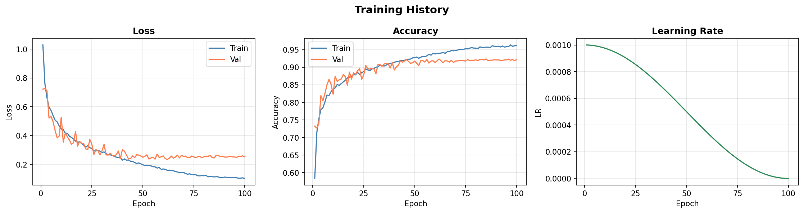

**Observations**

Despite being trained from scratch, the lightweight custom CNN achieved a reasonable baseline performance. However, the validation loss stopped converging after approximately 50 epochs while the training loss continued to decrease, indicating overfitting and a lack of generalization.

---

### 2.2 - Transfer Learning

**Description**

Among the three candidates (ResNet-50 (25M), EfficientNet-B2 (9M), and ConvNeXt-Tiny (28M)), ConvNeXt-Tiny was selected for transfer learning. It is the largest of the three and incorporates modern architectural designs inspired by Vision Transformers, such as depthwise convolution, LayerNorm, and GELU activation, which contribute to stronger representational capacity. The primary motivation was to explore the upper bound of achievable performance on this dataset using a more capable backbone.

Three unfreezing strategies were explored for fine-tuning. The first, head-only, is the most minimal approach, where only the classifier head is trained while the backbone remains frozen, making it a fast and low-cost baseline for transfer learning. The second, no freezing, unfreezes all layers from the start, allowing the entire network to adapt to the target dataset, but requiring more careful tuning of the learning rate to avoid catastrophic forgetting. The third, progressive unfreezing, gradually unfreezes the backbone stage by stage, from the head down to the earliest layers, with the goal of finding the sweet spot between preserving pretrained representations and adapting to the new domain.

**Summary**

* Model selection: ConvNext-Tiny from timm
* Dataset: seg_train with augmentation pipeline

* Three experiments
  * Common setup
    * Criterion: CrossEntropyLoss
    * Optimizer: AdamW, 1e-4 for weight decay 
    * Scheduler: CosineAnnealingLR

| Unfreezing Strategy  | Stage   | Macro F1   | Epochs | Learning Rate | Trainable Params (%) |
| -------------------- | ------- | ---------- | ------ | ------------- | -------------------- |
| **Head only**        | —       | 93.57%     | 10     | 1e-4          | 0.022%               |
| **No freezing**      | —       | 95.66%     | 10     | 1e-5          | 100%                 |
| **Progressive**      | Head    | 93.25%     | 3      | 1e-4          | 0.022%               |
|                      | Stage 3 | 95.15%     | 3      | 1e-5          | 55.6%                |
|                      | Stage 2 | 95.58%     | 5      | 1e-6          | 95.6%                |
|                      | Stage 1 | 95.56%     | 5      | 1e-7          | 99.1%                |
|                      | Stage 0 | 95.59%     | 5      | 1e-7          | 99.9%                |
| (ConvNext-Tiny-best) | All     | **95.74%** | 10     | 5e-7          | 100%                 |

Total parameters: 27,824,742

**Observations**

Among the three strategies, progressive unfreezing achieved the highest Macro F1 of 95.74%, followed by no freezing at 95.66%, and head-only at 93.57%. Notably, the majority of performance gain in progressive unfreezing was achieved by Stage 2 (95.58%), with only marginal improvement of 0.16% through full unfreezing. Given that earlier layers tend to capture general low-level features that transfer well across domains, unfreezing up to Stage 2 appears to be the most practical choice, offering a strong balance between performance and training cost. However, it should be noted that the training strategy is critical in progressive unfreezing, as improper learning rate scheduling or epoch allocation at each stage can easily lead to overfitting. In practice, finding the optimal configuration requires considerable experimentation, in which case full fine-tuning with a sufficiently small learning rate may be a more straightforward and competitive alternative.

---

### 2.3 - Evaluation

CNN-Baseline-best achieved a Macro F1 of 92.48%, while ConvNeXt-Tiny-best reached 95.74%, demonstrating the advantage of transfer learning with a modern backbone. ConvNeXt-Tiny-best showed notably better performance on difficult cases, suggesting stronger global context interpretation enabled by its architecture. The confusion matrix reveals that classification accuracy drops most significantly between buildings and street, and between glacier and mountain, which is consistent with the visual ambiguity observed during EDA. In contrast, sea and forest classes were classified with high accuracy. Analysis of misclassified samples indicates that incorrect labels are a contributing factor to accuracy degradation, highlighting the need for a thorough dataset refinement to correct mislabeled samples.

* [CNN-Baseline-best] Per-class accuracy, precision, and F1

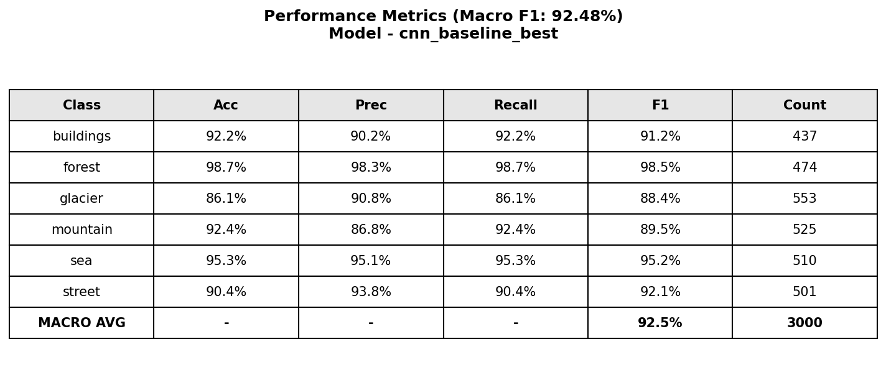

* [ConvNext-Tiny-best] Per-class accuracy, precision, and F1

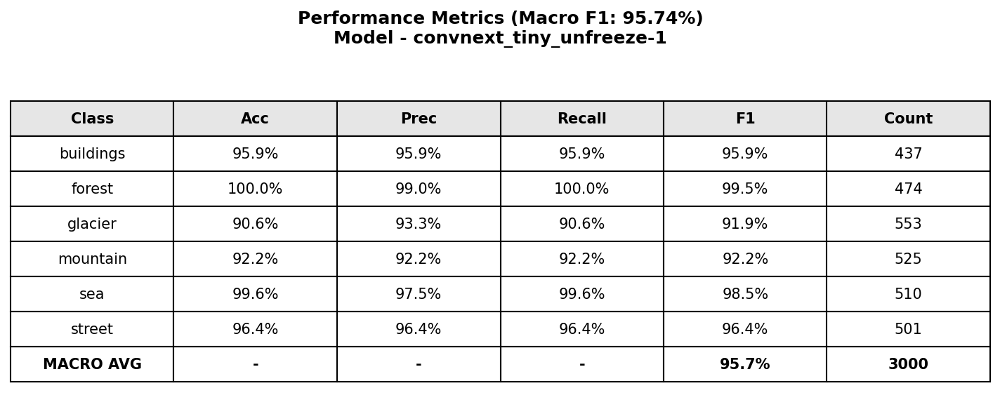

* Confusion matrix comparison: Left - CNN-Baseline-base / Right - ConvNext-Tiny-best

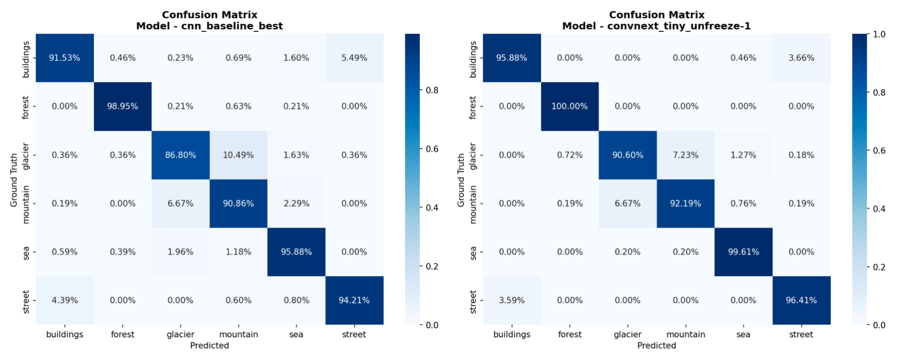

* Misclassified examples of ConvNext-Tiny-best

  These examples show the necessity of dataset refinement

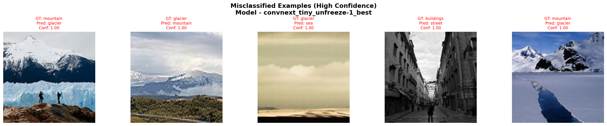

---

### 2.4 - Efficiency Trade-off Analysis

While ConvNeXt-Tiny-best outperforms CNN-Baseline-best by 3.26% in Macro F1, the gap is relatively modest considering that the baseline has nearly 16 times fewer parameters and was trained from scratch without any pretrained weights or performance optimization. This suggests that CNN-Baseline-best has considerable untapped potential. In particular, for resource-constrained edge device deployment, CNN-Baseline-best is a compelling choice given its simple architecture, lower memory footprint, and significantly faster inference time, which could be further accelerated through TensorRT optimization.

The 3% performance gap leaves meaningful room for improvement. Since image classification is a relatively straightforward task, it is well-suited for systematic model exploration. Promising directions include pretraining CNN-Baseline-best on ImageNet-1K followed by fine-tuning on the Intel dataset, as well as further tuning of the architecture, augmentation pipeline, and training strategy. Overall, CNN-Baseline-best remains a strong candidate, particularly in scenarios where computational efficiency is a priority.

If the model is intended for offline use, where computational constraints are less critical, the priority should shift toward maximizing accuracy, making ConvNeXt-Tiny the more appropriate choice with further performance optimization. However, before pursuing any additional improvements, correcting the mislabeled samples in the dataset should be the first step, as label noise directly undermines model accuracy regardless of the architecture chosen.

|                       | CNN-Baseline-best | ConvNeXt-Tiny-best |
| --------------------- | ----------------- | ------------------ |
| Trainable Parameters  | 1.7M              | 28M                |
| Training Time / Epoch | 36.3 sec          | 253 sec            |
| Macro F1              | 92.48%            | 95.74%             |
| Epochs                | 100               | 31                 |

---

## Part 3 — Targeted Diagnosis & Generalization

---

### 3.1 - Domain Shift

When evaluated on the STL-10 test set, ConvNeXt-Tiny-best demonstrated interesting generalization behavior. Images of ships or airplanes over the ocean were classified as sea with high confidence (≥0.9), images of trucks on roads were classified as street, and deer in forests were classified as forest. Since STL-10 and Intel dataset share no common classes, these results suggest that the model has effectively learned scene-level representations rather than object-level features, which is well-aligned with the nature of the Intel dataset as a scene classification benchmark.

See the samples at (row 1, col 1), (row 1, col 3), and (row 2, col 3)

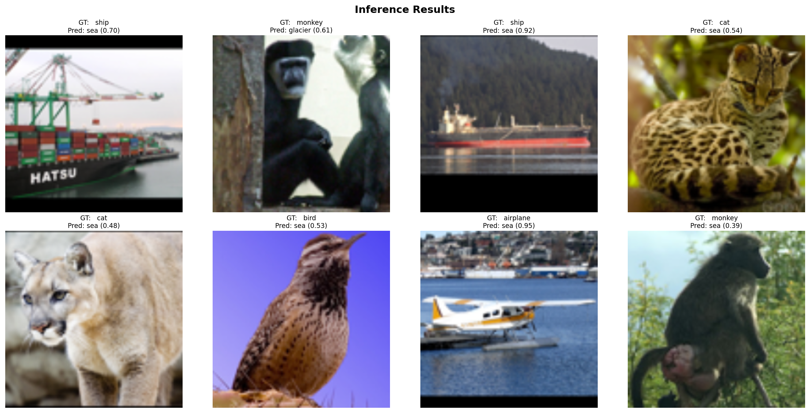

See the samples at (row 1, col 1), and (row 2, col 4)

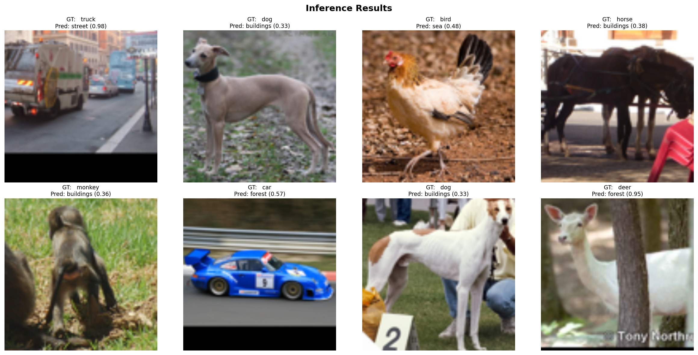

---

## 3.2 - Grad-CAM Visualization

Grad-CAM visualization on STL-10 samples reveals that the model has partially learned scene-level representations. In successful cases, activation maps highlight contextually relevant regions. For example, water surfaces for *sea*, dense vegetation for *forest*, and structured facades for *buildings*. However, failure cases are also observed, where the activation maps do not align with intuitive scene cues, suggesting that the model's generalization is inconsistent across out-of-distribution samples.

---
Good case: the sample at (col 2) shows high activation in both the ground and the deer within the forest scene, suggesting that the model captures relevant scene-level cues to correctly classify it as *forest*.

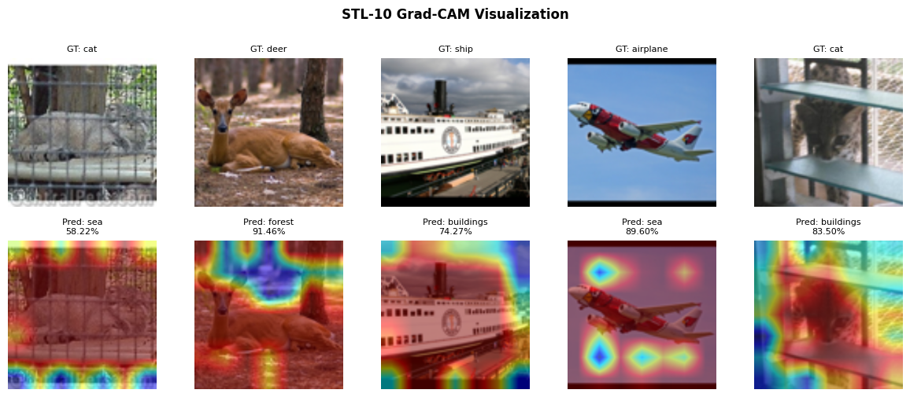

---

Failure case: the sample at (col 2) shows high activation in the truck region rather than the street area

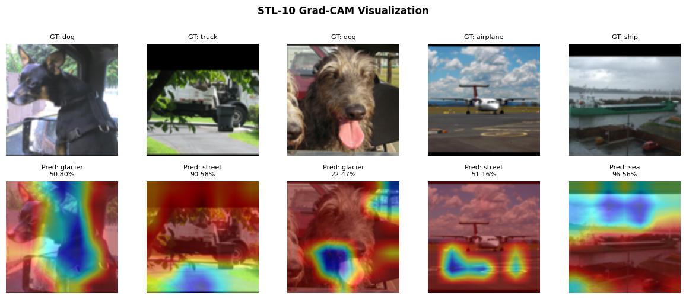

---

Failure case: the sample at (col 1) shows high activation in the deer region and is misclassified as sea

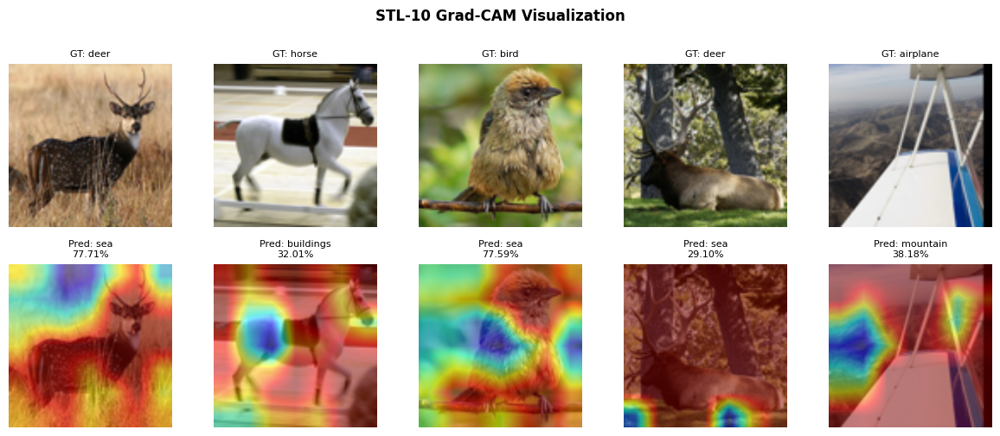

---

## 3.3 - Qualitative Questions

**Q1: What would you change in your approach to the questions presented if you had a week to solve**

**them instead of 3 days?**

**A:** Given more time, the following improvements would be prioritized.

* **Deeper transfer learning analysis:** This work only explored ConvNeXt-Tiny, but a more comprehensive comparison including ResNet-50, EfficientNet-B2, and YOLOv12s would provide a clearer picture of the accuracy-efficiency trade-off. In addition to parameter count, FLOPs would be measured to better quantify computational cost, which is critical for deployment decisions.

* **Label correction pipeline:** Rather than manually identifying mislabeled samples, a semi-automated pipeline would be developed to flag ambiguous or likely incorrect labels, enabling more systematic and scalable dataset refinement.

* **Synthetic data validation:** The effectiveness of the Stable Diffusion-generated images would be rigorously evaluated by comparing model performance with and without the synthetic data, as well as analyzing whether the generated samples improve generalization on underrepresented or ambiguous classes.

* **Upper bound performance with foundation models:** Training with a model such as DINOv3 would help establish the performance ceiling achievable on this dataset, providing a meaningful reference point for evaluating how much room for improvement remains with the current approach.

---

**Q2: Did Grad-CAM visualizations reveal something about your model that you didn't expect?**

**A:** Yes, the Grad-CAM visualizations revealed an unexpected finding. Although ConvNeXt-Tiny fine-tuned on the Intel dataset achieved strong classification performance, the activation maps on out-of-distribution samples suggest that generalization capability may have weakened compared to the original ImageNet-1K pretrained weights. This raises an interesting question: the head-only model, where the backbone remains frozen and retains the rich feature representations learned from ImageNet-1K, might actually produce more generalizable activation patterns. This hypothesis is worth investigating, especially given that the head-only model already achieved a competitive Macro F1 of 93.57%, suggesting that the pretrained backbone alone captures sufficiently discriminative features for this task.

---

**Q3: Our solutions mostly designed to run on edge devices with limited compute, how would you**

**approach preparing this solution to run on such devices?**

**A**: The first step would be to understand the computational constraints of the target edge device and determine the available budget for this specific task. Equally important is defining the acceptable accuracy threshold. If 92% Macro F1 is sufficient, the CNN baseline could be deployed immediately. With only 1.7M parameters, it is already compact, and further optimization through TensorRT or INT8 quantization would make it significantly faster.

If higher accuracy is required, edge-optimized architectures should be considered. The YOLO series, for example, offers strong backbone performance with well-established edge deployment support and pretrained weights. From personal experience, using YOLOv11s as a backbone for a panoptic segmentation task yielded 3% higher accuracy and 10% faster inference compared to RegNet-800MF, demonstrating its practical advantage in resource-constrained settings.

Finally, knowledge distillation would be applied to maximize accuracy within the edge compute budget. A large, high-performing teacher model would first be trained to achieve the best possible accuracy, and its knowledge would then be transferred to a smaller student model suitable for deployment. Beyond serving as a teacher, the large model can also function as an offline model for auto-labeling, performance validation, and label correction pipelines, making it a versatile asset throughout the entire development lifecycle.

---

## Part 4 - Data refinement and Re-training

Analysis of misclassified examples revealed that ambiguous labels and labeling errors are a significant source of accuracy degradation. Before further optimizing the augmentation pipeline, adding synthetic data, or tuning the training process, addressing the quality of the original dataset should be the first priority. Without it, it becomes difficult to determine whether performance limitations stem from the model and training process or from the data itself. This motivated the construction of a data refinement pipeline to systematically identify and correct problematic samples, followed by retraining the model on the refined dataset to assess the impact on classification performance.

### 4.1 - Data refinement

The refinement pipeline works as follows. Samples where the model predicts with high confidence (probability ≥ 0.9) but disagrees with the ground truth label are flagged as suspicious and collected into a candidate pool. These candidates are then sorted in descending order of prediction confidence, prioritizing the most likely mislabeled samples for manual review. In total, 52 and 39 suspicious samples were identified in the training and test sets respectively. Following manual inspection, 45 training samples and 30 test samples were confirmed as mislabeled and corrected, with all label updates saved in JSON format for reproducibility.

**Examples of suspicious labels on training set**

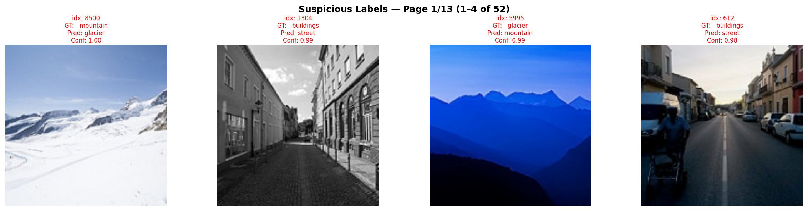

**Examples of suspicious labels on test set**

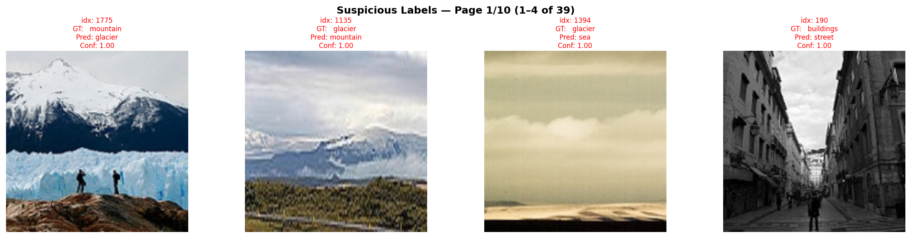

### 4.2 Re-training

To validate the impact of the refined dataset, both the CNN baseline and ConvNeXt-Tiny with full unfreezing were retrained under the same training setup. Evaluation on the refined test set shows consistent improvement across both models, with the CNN baseline gaining 1.05% and ConvNeXt-Tiny gaining 0.73% in Macro F1. Analysis of the remaining misclassified examples from ConvNeXt-Tiny reveals that the number of clear labeling errors has significantly reduced. The residual misclassifications are predominantly samples that are genuinely ambiguous even to human judgment, suggesting that the model has reached a level where further gains will require either clearer labeling guidelines or more sophisticated modeling strategies.

| Model                     | Original Test Set | Refined Test Set | Δ      |
| ------------------------- | ----------------- | ---------------- | ------ |
| CNN-Baseline-best         | 92.48%            | 93.53%           | +1.05% |
| ConvNeXt-Tiny-No-Freezing | 95.66%            | 96.39%           | +0.73% |

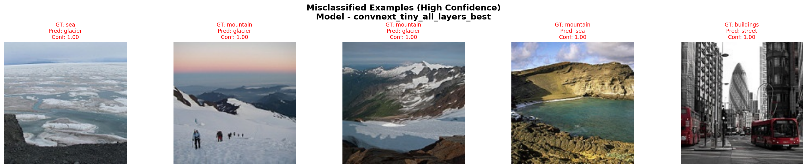

This also highlights a fundamental limitation of single-label classification for scene understanding. Unlike object classification, where a single label can unambiguously describe the primary subject, scene classification often involves multiple coexisting elements. A street scene may contain buildings, and a glacier may be indistinguishable from a snow-covered mountain. Assigning a single label to such scenes is inherently ambiguous, and may impose an artificial constraint on both the annotation process and the model's learning objective. A multi-label classification formulation, or a more fine-grained labeling guideline, could better reflect the complexity of real-world scenes.
